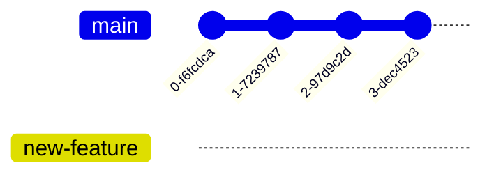
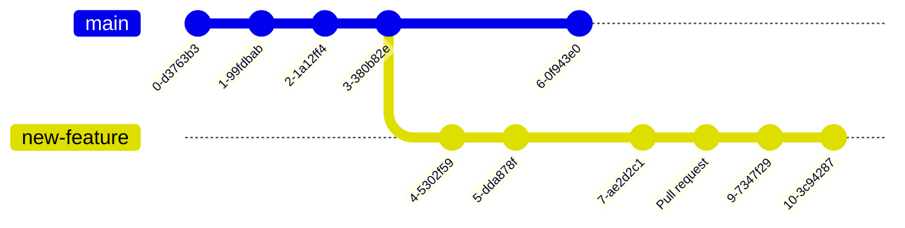

# Practical Application of NESA Software Engineering MLOps

This Jupyter Notebook collection is designed to support students understand Machine Learning Operations (MLOps) at the manual level of MLOps automation, specifically it's practical processes as defined in the [NESA Software Engineering Course Specifications](https://library.curriculum.nsw.edu.au/341419dc-8ec2-0289-7225-6db7f2d751ef/94e1eb0a-0df7-4dbe-9b72-5d5e0d17143a/software-engineering-11-12-higher-school-certificate-course-specifications.PDF) pg 27. Students can then explore further how these processes can be automated under a DevOps/MLOps model.


> [!Important]
> This a corrected version of the MLOps course specification.

## 3 Levels of MLOps Automation

To implement MLOps, a team will progress through three levels of automation.

### Level 1 MLOps Manual Process


**Manual process** is the data science processes, which are performed at the beginning of implementing ML. This level has an experimental and iterative nature. Every step in each pipeline, such as data preparation and feature engineering, model training and testing, are executed manually. Data Engineers use Rapid Application Development (RAD) tools, such as Jupyter Notebooks.

### Level 2 MLOps ML pipeline automation


**ML pipeline automation**. The next level includes the execution of model training automatically. We introduce here the continuous training of the model. Whenever new data is available, the process of model retraining is triggered. This level of automation also includes data and model validation steps using testing scripts and/or specialised tools.

### Level 3 MLOps CI/CD pipeline automation


**CI/CD pipeline automation**. In the final stage, we introduce a CI/CD system to perform fast and reliable ML model deployments in production. The core difference from the previous step is that we now automatically build, test, and deploy the Data, ML Model, and the ML training pipeline components.

## 1. MLOps Design Phase

https://www.wisdomgeek.com/development/data-science/converting-business-problem-machine-learning/

1. Defining the business problem to be solved

   - Doctors often under estimate the progress of type II adult onset diabetes after diagnosis. Often resulting in the insufficient medical interventions and reduced health outcomes for patients.

   - Doctors would like a valid and reliable tool for doctors to be able to enter an individuals health data and be provided with a valid and reliable prediction of the disease progression over the patients next 12 months.

2. Refactoring the business problem into a machine learning problem

   - _Students to refactor the provided business problem_

3. Defining success metrics

   - _Students to define success metrics_

4. Researching available data.

   - Your have sourced a validated raw data set. The data is saved in the CSV file [2.1.2.Diabeties_Sample_Data.csv](/2.Model_Development/2.1.Data_Wrangling/2.1.2.Diabeties_Sample_Data.csv).

     > [!Important]
     > The information and ranges provided below are to help students understand the domain of the data, it is not intended as medical or diagnostic advice.

   - The data columns are:

     | Column | Data                                                                                                                                                                                                                                                                                                 |
     | ------ | ---------------------------------------------------------------------------------------------------------------------------------------------------------------------------------------------------------------------------------------------------------------------------------------------------- |
     | DoB    | The patients Date of Birth recorded as D/MM/YYYY                                                                                                                                                                                                                                                     |
     | DoT    | The patients date of testing records as D/MM/YYYY                                                                                                                                                                                                                                                    |
     | SEX    | Patients gender ---                                                                                                                                                                                                                                                                                  |
     | BMI,   | Patients body mass index, which gives an indication of the patients body size and is calculated using their weight and height ---                                                                                                                                                                    |
     | BP     | Diastole blood pressure which is the pressure of blood on the walls of the patients arteries when their heart was relaxed. <80 is desirable, 80-95 is high >95 is very high.                                                                                                                         |
     | TC     | Total cholesterol is a measure of the cholesterol in the patients body. Cholesterol is essential in order for your body to continue building healthy cells, however having high cholesterol can increase your risk of heart disease. <5.5 is desirable 5.5-6.6 is borderline and >6.5 is undesirable |
     | BGU    | Patients fasting blood glucose levels. 75-99 is desirable and 100+ is undesirable.                                                                                                                                                                                                                   |
     | FDR    | The number of family members in the individuals direct bloodline who have developed type 2 adult onset diabetes.                                                                                                                                                                                     |
     | Target | A quantitative measure of disease progression one year after baseline. Patients should aim towards `0` as this means the condition has not progressed further.                                                                                                                                       |

     > [!Note]
     > This is a [real data set](https://www4.stat.ncsu.edu/~boos/var.select/diabetes.html) used in [real statistical medical research](https://imjohnstone.su.domains/WEBLIST/2004/LarsAnnStat04.pdf) that has been modified for the purposes of teaching data wrangling and feature engineering.

## 2. MLOps Model Development Phase

### 2.1 Data Wrangling

1. The [Understand The Data Demonstration](/2.Model_Development/2.1.Data_Wrangling/2.1.1.data_preview.ipynb) provides a demonstration of a basic data wrangling (also called data preprocessing) using the Pandas library and Matplotlib. To understand your dataset using snapshots, data summaries, graphs and descriptive statistics.
2. The [Data Wrangling Demonstration](/2.Model_Development/2.1.Data_Wrangling/2.1.2.data_wranglish.ipynb) provides a demonstration of more advanced data wrangling. To clean and prepare the data for feature engineering and model training, ensuring that it is in a usable format.

### 2.2 Feature Engineering

1. The [Feature Engineering Demonstration](/2.Model_Development/2.2.Feature_Engineering/2.2.1.feature_engineering.ipynb) provides a demonstration on enhancing the data set by creating new features or modifying existing ones to improve model performance.

### 2.3 Model Training

1. The [Raw Demonstration](/2.Model_Development/2.3.Model_Training/2.3.1.raw_course_specification.ipynb) of the course specification provides a direct application (after debugging) of each step of the algorithm.

   > [!Note]
   > There are some variations from the NESA course specifications to address syntax errors, missing methods and readability.

2. The [Graphical Demonstration](/2.Model_Development/2.3.Model_Training/2.3.2.graphical_course_specification.ipynb) of the course specifications provides graphs visualising each step of the algorithm.
3. The [CSV Demonstration](/2.Model_Development/2.3.Model_Training/2.3.3.CSV_course_specification.ipynb) of the course specifications uses a CSV upload of the data so larger model training data sets can be used.
4. The [SQL Demonstration](/2.Model_Development/2.3.Model_Training/2.3.4.SQL_course_specification.ipynb) of the course specifications imports the data from a SQL database so the data can be managed in a database.

### 2.4 Model Testing and Validation

1. The [Model Testing and Validation Demonstration](/2.Model_Development/2.4.Model_Testing_and_Validation/2.4.1.model_test_and_validate.ipynb) provides a number of ways to evaluate, test and validate your model using a second set of test data and then refine your model. This demonstration uses a different regression algorithm to the course specifications.

## 3. MLOps Operations Phase

### 3.1 Deploying a Model

1. The [Model Deployment](/3.Operations/3.1.Deploy_Model/3.1.1.Basic_Model_Depolyment.ipynb) exports the model so a separate Python implementation can use it to make predictions. The demonstration also includes how to save a Matplotlib image so it can be used in a UI or served by an API.

### 3.2 Supporting operations/use

- [Versioning](#mlops-version-control) through
  - **Continuous integration (CI)** is a software development practice that automates the process of integrating code changes from multiple developers into a central repository.
  - **Continuous deployment (CD)** is a strategy in software development where code changes to an application are released automatically into the production environment.

### 3.3 Monitoring model performance.

- **Continuous Testing (CT)** is a property unique to ML systems, that's is concerned with automatically retraining and serving the models.

[Watch this DataCamp Video](https://campus.datacamp.com/courses/fully-automated-mlops/automation-in-mlops-deployments?ex=10) about the CI/CD/CT pipeline.

---

## Support

### MLOps Version Control

Version control is essential for MLOps especially in the CI and CD pipeline (continuous integration and continuous delivery/deployment). This pipeline allows new features to be added while also keeping the main branch (also called the production branch) stable. This also has the benefit of supporting collaboration in the SDLC.

1. Create a new branch for our feature.

```bash
git checkout -b new-feature main
```



2. Develop the feature.
   This checks out a branch called new-feature based on main, and the -b flag tells Git to create the branch if it doesn’t already exist. On this branch, you then edit, stage, and commit changes as you would, building up your new feature with as many commits as necessary:

```bash
git status
git add <some-file>
git commit
```


3. Make the development available to others in your team.
   So other data scientists and software engineers collaborating with you can access the feature under development.

```bash
git push -u origin new-feature
```

The main branch can continue to be maintained including integration of other new features. You can pull any changes into your feature branch.

```bash
git pull -u origin main
```

This command pushes new-feature to the central repository (origin), and the -u flag adds it as a remote tracking branch. After setting up the tracking branch, you can call git push without any parameters to push her feature.

4. Create a Pull request for the completed feature.

Before merging it into main, you need to file a pull request letting the rest of the team know your feature is ready for testing and integration.


```Bash
git push
```

Then, you create the pull request in the Git GUI asking to merge new-feature into main, and team members will be notified automatically. The great thing about pull requests is that they show comments right next to their related commits, so it's easy to ask questions about specific changesets.

5. Review Pull request

The pull request may be evaluated by you, your team, a sub team or the senior software engineer. Any changes to the Pull request should be made in the Pull request interface for documentation.



6. Make any revisions generated through the Pull requestions
   Edit, stage, commit, and push updates to the central repository.

7. Merge the feature
   Once the team is ready to accept the pull request, someone needs to merge the feature into the stable project (this can be done by anyone in the team):


```bash
git checkout main
git pull
git pull origin marys-feature
git push
```

### Metalanguage

| Metalanguage        | Definition                                                                                                                                                                                                                                                                                                                                          |
| ------------------- | --------------------------------------------------------------------------------------------------------------------------------------------------------------------------------------------------------------------------------------------------------------------------------------------------------------------------------------------------- |
| Cost                | Cost measures the performance of a machine learning model for a data set. Cost function quantifies the error between predicted and expected values and presents that error in the form of a single real number.                                                                                                                                     |
| Data preprocessing  | Is another name for 'Data Wrangling' but generally refers to the simpler approaches.                                                                                                                                                                                                                                                                |
| Data wrangling      | Data Wrangling is the process of evaluating, filtering, manipulating, and encoding data so that a machine learning algorithm can understand it and use the resulting output. The major goal of data preprocessing is to eliminate data issues such as missing values, improve data quality, and make the data useful for machine learning purposes. |
| Feature             | A feature is an individual measurable property within a recorded dataset. In machine learning and statistics, features are often called “variables” or “attributes.”                                                                                                                                                                                |
| Feature Engineering | Feature engineering, in data science, refers to manipulation — addition, deletion, combination, mutation — of your data set to improve machine learning model training, leading to better performance and greater accuracy. Effective feature engineering is based on sound knowledge of the business problem and the available data sources.       |
| Linear Regression   | Linear regression is a statistical technique used to find the relationship between variables. In an ML context, linear regression finds the relationship between features and a target.                                                                                                                                                             |
| Mean                | The average value.                                                                                                                                                                                                                                                                                                                                  |
| Median              | The mid point value.                                                                                                                                                                                                                                                                                                                                |
| Mode                | The most common value.                                                                                                                                                                                                                                                                                                                              |
| Prediction          | Prediction in machine learning is to make a future guess about possible outcomes based on historical data.                                                                                                                                                                                                                                          |
| Range               | The lowest and highest value.                                                                                                                                                                                                                                                                                                                       |
| Standard Deviation  | Standard deviation is a measure of the amount of variation or dispersion of a set of data values around their mean. In machine learning, it is an important statistical concept that is used to describe the spread or distribution of a dataset.s                                                                                                  |
| Target              | The target variable is the variable whose values are modelled and predicted by other variables.                                                                                                                                                                                                                                                     |

## Jupyter Notebooks In the TempeHS Machine Learning Series

1. [Scikit-learn Linear Regression](https://github.com/TempeHS/NESA_Course_Specifications_Linear_Regression), A Jupyter Notebook collection designed to support students' understanding of the Linear Regression model defined in the NESA Software Engineering Course Specifications pg 28.
2. [NESA Software Engineering - Machine Learning OOP Implementation Examples](https://github.com/TempeHS/Machine_Learning_OOP_Implementation_Examples), A Jupyter Notebook collection designed to support students implement Programming for automation in the NESA Software Engineering Syllabus specifically using an OOP to make predictions.
3. [Practical-Application-of-NESA-Software-Engineering-MLOps](https://github.com/TempeHS/Practical-Application-of-NESA-Software-Engineering-MLOps), A Jupyter Notebook collection designed to develop a practical understanding of Machine Learning Operations (MLOps) defined in the NESA Software Engineering Course Specifications pg 27.

<p xmlns:cc="http://creativecommons.org/ns#" xmlns:dct="http://purl.org/dc/terms/"><a property="dct:title" rel="cc:attributionURL" href="https://github.com/TempeHS/Practical-Application-of-NESA-Software-Engineering-MLOps">Practical Application of NESA Software Engineering MLOps</a> by <a rel="cc:attributionURL dct:creator" property="cc:attributionName" href="https://github.com/benpaddlejones">Ben Jones</a> is licensed under <a href="https://creativecommons.org/licenses/by-nc-sa/4.0/?ref=chooser-v1" target="_blank" rel="license noopener noreferrer" style="display:inline-block; ">Creative Commons Attribution-NonCommercial-ShareAlike 4.0 International</a></p>
